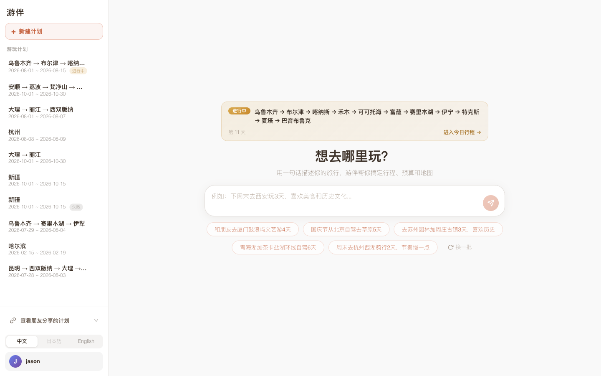
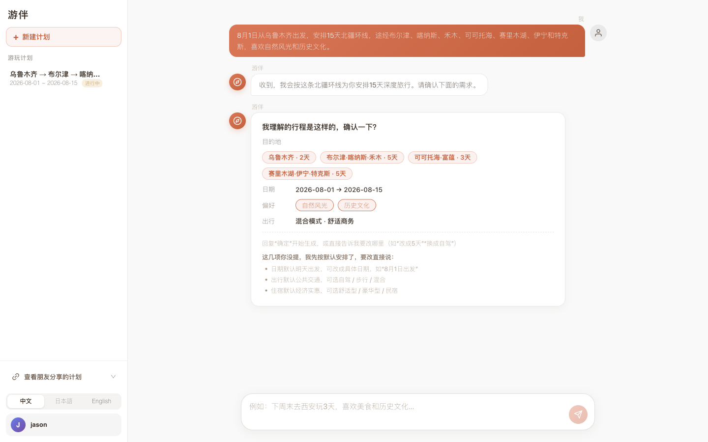
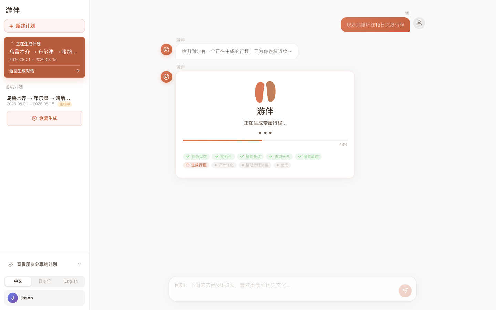
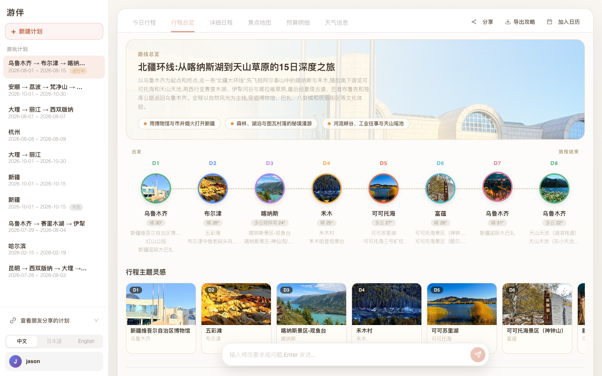
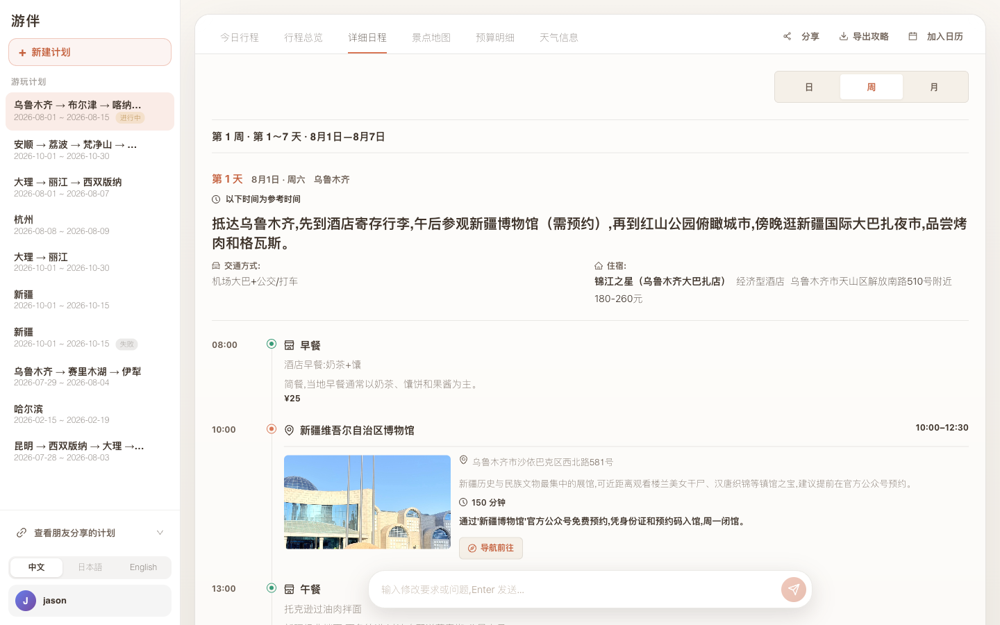
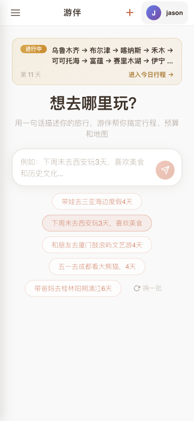
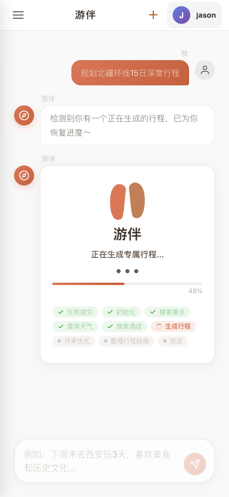
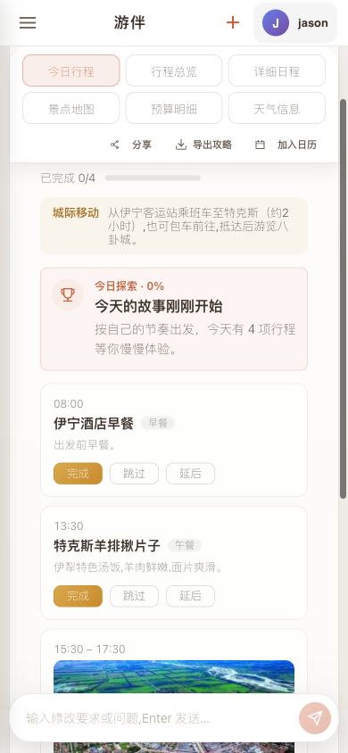
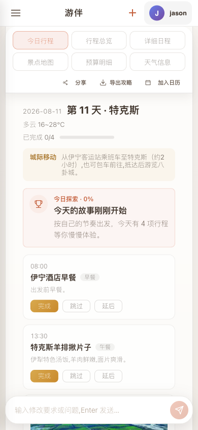

# 游伴

<p align="center">
  
</p>

<p align="center">
  <strong>智能旅行规划助手 · PC Web、移动 H5 与微信小程序</strong>
</p>

<p align="center">
  
  
  
  
</p>

<p align="center">
  <a href="#-功能特性">功能特性</a> •
  <a href="#-应用展示">应用展示</a> •
  <a href="#-快速开始">快速开始</a> •
  <a href="#-技术架构">技术架构</a> •
  <a href="#-docker-部署">部署指南</a>
</p>

---

## 📖 项目简介

**游伴** 是一款基于 AI 的智能旅行规划助手，通过自然语言对话帮助用户轻松规划完美旅程。只需告诉游伴你的旅行需求，AI 就会自动生成包含景点、美食、住宿、交通的详细行程，并在地图上直观展示路线。

### 🎯 核心亮点

| 特性 | 描述 |
|------|------|
| 🧠 **AI 智能规划** | Pi SDK 与 `pi-subagents` 真实子 Agent 协作，确定性编排守住状态和权限边界 |
| 💬 **自然语言交互** | 像聊天一样描述行程，AI 实时响应调整 |
| 🧭 **旅行蓝图** | 按阶段呈现路线主题、规划逻辑、节奏与代表体验 |
| 🗓️ **自适应日程** | 按行程长度自动选择日/周/月分组，完整展示每日时间线 |
| 🗺️ **地图可视化** | 高德地图统一提供地点、路线与导航数据 |
| 🌤️ **天气智能** | 实时天气集成，自动优化行程安排 |
| 📲 **微信小程序** | 与 PC Web、H5 共用 unibest/uni-app 工程，登录、行程、地图、分享和系统动作均为原生页面能力 |
| 🔑 **统一账号** | Web 端展示小程序码，用户在微信小程序内显式确认；小程序通过 `wx.login` 登录，并以 UnionID 关联同一账号 |
| 🌐 **三语界面** | Web 与小程序支持中文、English、Français，并同步账号显示偏好 |
| 🏨 **酒店参考价** | 可选接入飞猪预估参考价，明确展示来源和估价属性，不冒充实时可订价格 |
| 📱 **安全分享** | 显式发布高熵分享码，支持只读链接、二维码与图片导出 |
| 🔐 **数据安全** | 账号级数据隔离、本地部署与可审计生产切换，数据完全掌控 |

---

## 🆕 2.0.12 更新

当前源码版本为 **2.0.12**，前端、后端与共享契约版本保持一致；小程序 `versionCode` 为 `212`。源码版本不代表微信审核或正式发布状态。

- **统一品牌与三端体验**：产品名称统一为「游伴」，PC Web、移动 H5 和微信小程序共用业务模型与中英法三语资源。
- **微信一键登录**：不再要求先选择头像；网页仍通过小程序扫码并显式确认登录，账号设置保留头像修改能力。
- **登录后继续规划**：小程序未登录时保留待发送的旅行需求，登录成功后继续发送。
- **完整生成进度**：展示阶段、当前步骤与详细事件，保留任务恢复、失败重试和进度自动跟随。
- **行程与地图**：完善真机日期、金额和天气展示兼容性，以及地图切换、路线展示和移动端布局。
- **分享与历史行程**：只读分享页适配小程序顶部安全区，已登录用户可返回自己的行程列表。
- **开发与部署**：H5 开发通过同源代理处理认证 Cookie；Docker 构建保留类型检查与运行时导入验证，全量测试在构建前单独执行。

---

## 🖼️ 应用展示

### PC 端

#### 1. 规划首页 - 描述旅程，继续进行中的行程

<p align="center">
  
</p>

#### 2. 对话确认 - 游伴理解需求并与你确认

<p align="center">
  
</p>

#### 3. 生成行程 - 清晰展示当前规划进度

<p align="center">
  
</p>

#### 4. 行程总览 - 从旅行蓝图把握整段旅程

<p align="center">
  
</p>

#### 5. 详细日程 - 查看安排、发起导航并加入日历

<p align="center">
  
</p>

---

### 移动端

<p align="center">
  
  &nbsp;&nbsp;
  
  &nbsp;&nbsp;
  
  &nbsp;&nbsp;
  
</p>

---

## ✨ 功能特性

### 🗺️ 智能行程规划
- **多日行程自动生成** - 根据目的地和天数自动规划
- **景点智能推荐** - 基于用户偏好推荐景点
- **路线优化** - 自动计算最优游览顺序
- **多城市支持** - 支持跨城市行程规划
- **旅行蓝图** - 展示阶段主题、路线逻辑、节奏与代表体验
- **自适应日程** - 按日/周/月组织长短不同行程，所有日期保持完整展开
- **参考时间线** - 统一展示城际移动、景点起止时间和用餐时间，不冒充实时班次或预约结果

### 💬 对话式交互
- **自然语言理解** - 用日常语言描述需求
- **实时流式响应** - 边生成边展示，体验流畅
- **上下文记忆** - 记住用户偏好和历史对话
- **行程调整** - 随时通过对话修改行程

### 📲 微信小程序与统一账号
- **微信一键登录** - 用户主动点击登录，通过 `wx.login` 建立账号会话，无需先选择头像；头像可在账号设置中修改
- **Web 小程序码登录** - 网站只展示服务端生成的小程序码；扫码后必须在原生确认页主动确认，个人主体无需网站应用认证
- **浏览器绑定挑战** - 五分钟单次挑战只允许创建它的浏览器兑换，校验凭据只保存在 HttpOnly Cookie 中
- **UnionID 统一身份** - 同一小程序的 OpenID 与可用的 UnionID 用于关联业务账号，不按昵称合并身份
- **会话管理** - 小程序和 Web 会话分别签发，可查看并撤销其他设备会话
- **公开路由** - 隐私说明与只读分享保持公开，其余个人行程、对话和偏好均要求认证
- **原生系统能力** - 小程序直接使用原生地图、分享、相册和日历能力；H5 使用浏览器下载、剪贴板与打印能力

### 🌤️ 天气集成
- **实时天气** - 展示目的地天气预报
- **智能建议** - 根据天气调整行程安排
- **穿衣提示** - 提供出行穿衣建议

### 📍 地图可视化
- **统一高德地图** - Web、H5 与小程序统一使用高德地点与路线数据
- **路线展示** - 直观展示行程路线
- **POI 搜索** - 景点、餐厅、酒店搜索
- **距离计算** - 自动计算景点间距离和交通时间

### 💰 可审计预算
- **人均与合计切换** - 预算台账统一保存合计金额，页面可随时切换人均口径
- **酒店预算边界** - 只接受可信上游明确提供的金额，不由 LLM 推测酒店价格
- **飞猪参考价** - 可选展示飞猪预估每晚价格、来源链接和查询时间，仅作行程预算参考
- **真实来源降级** - 保留高德可信酒店 POI；飞猪不可用或没有报价时金额显示待填写
- **用户 DIY** - 用户可新增、修改、删除和恢复预算条目，手动价格优先于自动同步

### 🔖 行程管理
- **历史记录** - 保存所有行程规划
- **行程编辑** - 随时修改已规划行程
- **收藏功能** - 收藏喜欢的行程
- **导出功能** - Web 支持图片与 PDF，小程序支持保存行程图片
- **一键导航** - 从每日地点直接发起导航
- **日历导出** - 将完整行程加入日历
- **今日反馈** - 记录打卡和跳过后的当天回响

### 📱 分享功能
- **显式发布** - 仅计划拥有者可以为已完成行程创建分享码
- **安全分享码** - 使用 32 位高熵随机码，不直接公开内部计划编号
- **只读分享页** - 访客只能读取最终行程，不能修改预算或发起对话
- **链接与二维码** - 支持复制分享链接、分享码和下载二维码

### 🔐 后台管理
- **用户管理** - 查看和管理用户
- **行程管理** - 管理所有行程数据
- **系统配置** - 运行时配置调整
- **Skills 管理** - 安装、审阅、分配、启用、版本更新、归档和恢复 Agent 指令
- **数据统计** - 用户和行程统计

#### Skills 管理

启动服务后打开 `/admin`，输入 `DATA_DIR/admin_password.txt` 中的后台密码，然后选择始终可见的一级入口 **Skills**。首次启动会创建默认密码 `admin@123`；正式部署应立即修改该文件并限制读取权限。

- **ZIP 安装**：上传包中必须恰好包含一个 `SKILL.md`，可以位于根目录或唯一的一层包目录。归档最多包含 100 个普通文件、10 MiB 未压缩数据，`SKILL.md` 最大 256 KiB。新安装只创建“候选版本”，默认保持停用。
- **Git 安装**：只接受 HTTPS 仓库地址，可指定分支、标签、提交或 Skill 子目录。私有仓库凭据仅从服务端 `YOUBAN_SKILL_GIT_TOKEN` 读取，并且只有仓库主机与 `YOUBAN_SKILL_GIT_TOKEN_HOST` 精确匹配时才会发送；凭据不会写入浏览器、数据库、包文件或日志。
- **审阅与激活**：候选版本先展示完整内容、SHA-256、来源和分配范围。只有显式激活后，新内容才进入运行时；在线编辑和 Git 更新期间，现有激活版本继续工作。Git 更新只能由管理员手动检查，不会定时拉取，也不会自动激活。
- **Agent 分配**：支持且仅支持六个目标：`parent-assistant`、`destination-researcher`、`segment-planner`、`summary`、`itinerary-reviewer`、`plan-editor`。全局停用会覆盖分配关系，再次启用仍保留原分配。
- **内置与自定义 Skill**：四个内置 Skill 可以查看、停用、启用和重新分配，但内容只读，不能编辑、归档、恢复或删除。自定义 Skill 必须先停用才能归档；恢复后保持停用，需要管理员再次启用。
- **安全边界**：运行时只读取经过校验的 `SKILL.md` 文本。包中的脚本、依赖、清单、资源和引用仅作为惰性文件保留，系统不会执行脚本、安装依赖、加载扩展或扩大 Agent 工具权限。

需要复现 Skills 页面验收环境时，先构建前端，再启动任务自有夹具：

```bash
cd frontend && pnpm build:h5
cd ../backend && bun run browser:skills-fixture
```

脚本会输出一行 JSON，其中包含 Admin URL、API URL、有效 ZIP 路径和清理标识；使用 `Ctrl+C` 停止后，只会删除该次运行创建的临时数据目录。

---

## 🛠️ 技术架构

### 前端技术栈

| 技术 | 版本 | 说明 |
|------|------|------|
| [unibest](https://github.com/feige996/unibest) | 4.4.1 | PC Web、H5 与小程序的统一工程骨架 |
| [uni-app](https://uniapp.dcloud.net.cn/) | Vue 3 | 跨端页面、生命周期与平台 API |
| [Vue 3](https://vuejs.org/) | 3.4+ | 页面与组件运行时 |
| [TypeScript](https://www.typescriptlang.org/) | 5.5.4 | 跨端业务与接口契约 |
| [Vite](https://vitejs.dev/) | 5.2+ | H5 与小程序构建工具 |
| [Wot UI](https://wot-ui.cn/) / UnoCSS | - | 跨端组件与样式体系 |
| [Pinia](https://pinia.vuejs.org/) | 2.0.36 | 跨端状态管理 |
| [高德地图 JS API](https://lbs.amap.com/) | - | 国内地图服务 |
| [vue-i18n](https://vue-i18n.intlify.dev/) | 9.1.9 | 国际化插件 |
| [Vitest](https://vitest.dev/) | 3.2.4 | 业务逻辑、组件与跨端兼容回归测试 |

### 后端技术栈

| 技术 | 版本 | 说明 |
|------|------|------|
| [Bun](https://bun.sh/) | 1.4 | TypeScript 运行时、测试、SQLite 与性能分析 |
| [Elysia](https://elysiajs.com/) | 1.4+ | Bun 原生 HTTP、SSE、WebSocket 与 TypeBox 校验 |
| [Pi SDK](https://github.com/badlogic/pi-mono) | 0.84.2 | 模型、Agent 会话与扩展宿主 |
| `pi-subagents` | 0.53.0 | 真实子 Agent、结构化输出、并行与取消 |
| `pi-hermes-memory` | 0.9.6 | 用户偏好记忆与隔离存储 |
| [Drizzle ORM](https://orm.drizzle.team/) | 0.45+ | `bun:sqlite` 类型安全持久化 |

### 微信小程序技术栈

| 技术 | 说明 |
|------|------|
| unibest / uni-app | 与 PC Web、H5 共用页面、状态、接口契约和多语言资源 |
| `wx.login` | 仅把临时代码发送到服务端换取微信身份，客户端不接触 AppSecret 或 `session_key` |
| 原生 `<map>` 与 `wx.*` API | 地图、导航、分享、相册和日历动作在小程序内完成 |

酒店和景点链路以高德可信 POI 为身份和坐标基础。Agent 只能选择服务端分配的候选 ID；身份、坐标和价格不能由 LLM 生成。飞猪报价是可选的预估参考价，不代表实时库存、最终成交价或预订保证；没有可靠报价时保留待填写状态。

### 系统架构图

```
┌─────────────────────────────────────────────────────────────┐
│                  用户浏览器 / 微信小程序                     │
└─────────────────────────┬───────────────────────────────────┘
                          │
                          ▼
┌─────────────────────────────────────────────────────────────┐
│              统一前端 (unibest + uni-app + Vue 3)           │
│  ┌─────────┐  ┌─────────┐  ┌─────────┐  ┌─────────┐       │
│  │ 对话界面 │  │ 行程展示 │  │ 地图组件 │  │ 管理后台 │       │
│  └─────────┘  └─────────┘  └─────────┘  └─────────┘       │
└─────────────────────────┬───────────────────────────────────┘
                          │ HTTP / SSE / WebSocket
                          ▼
┌─────────────────────────────────────────────────────────────┐
│                 后端 (Bun 1.4 + Elysia)                     │
│  ┌─────────────────────────────────────────────────────┐   │
│  │                    API 路由层                        │   │
│  │  /api/trip  /api/chat  /api/poi  /api/map  /admin  │   │
│  └─────────────────────────────────────────────────────┘   │
│                          │                                  │
│                          ▼                                  │
│  ┌─────────────────────────────────────────────────────┐   │
│  │                  服务层 (Services)                    │   │
│  │  LLM 服务 │ 地图服务 │ 天气服务 │ 记忆服务 │ 用户服务│   │
│  └─────────────────────────────────────────────────────┘   │
│                          │                                  │
│                          ▼                                  │
│  ┌─────────────────────────────────────────────────────┐   │
│  │            Pi Agent + 确定性编排层                    │   │
│  │  持久父 Agent │ pi-subagents │ 分段规划与检查点       │   │
│  └─────────────────────────────────────────────────────┘   │
└─────────────────────────┬───────────────────────────────────┘
                          │
          ┌───────────────┼───────────────┐
          ▼               ▼               ▼
    ┌──────────┐   ┌──────────┐   ┌──────────┐
    │ LLM API  │   │ 地图 API │   │ 数据存储  │
    │ (OpenAI) │   │  (高德)  │   │ (SQLite)  │
    │          │   │          │   │          │
    └──────────┘   └──────────┘   └──────────┘
```

---

## 🚀 快速开始

### 环境要求

- Bun 1.4+
- Node.js 20+ 与 pnpm 10+
- LLM API Key（OpenAI 或兼容 API）
- 高德地图 Web 服务 Key；Web 地图展示另需 JS API Key
- 真实微信登录需要小程序 AppID、AppSecret 与至少 32 字节的 `AUTH_PEPPER`；仅模拟器联调可使用下文开发模式

除克隆步骤外，以下各终端命令均从仓库根目录开始执行。

### 1. 克隆项目

```bash
git clone https://github.com/A6083450/youban.git
cd youban
```

### 2. 配置环境变量

复制环境变量示例文件并填写配置：

```bash
cp .env.example .env
```

编辑 `.env` 文件，配置以下必要参数：

```env
# LLM API 配置（必填；LLM_* 别名仍兼容）
OPENAI_API_KEY=your_api_key_here
OPENAI_BASE_URL=https://api.openai.com/v1
OPENAI_MODEL=gpt-4

# 高德地图 API（必填，用于国内地图服务）
VITE_AMAP_WEB_JS_KEY=your_amap_web_js_key
VITE_AMAP_WEB_KEY=your_amap_web_key

# 真实微信登录（服务端配置，不要写入前端）
WECHAT_APP_ID=your_miniprogram_app_id
WECHAT_APP_SECRET=your_miniprogram_app_secret
AUTH_PEPPER=your_random_value_at_least_32_bytes
```

`AUTH_PEPPER` 应使用 `openssl rand -hex 32` 生成的随机值替换。自有小程序还需将
`frontend/env/.env` 中的 `VITE_WX_APPID` 设为同一 AppID。
后台保存的非空运行时配置优先于环境变量，调整 `.env` 后如未生效，请检查后台设置。

### 3. 启动后端

```bash
cd shared/contracts
pnpm install --frozen-lockfile --ignore-scripts

cd ../../backend
bun install --frozen-lockfile
bun --env-file=../.env run dev
```

共享契约以本地包方式同时供前后端使用，因此首次检出或清理依赖后，必须先安装
`shared/contracts` 自身的运行时依赖。显式加载仓库根目录的 `.env` 后，后端使用示例配置中的
`7860` 端口；未设置 `PORT` 时默认使用 `8000`。

### 4. 启动前端

```bash
cd frontend

# 安装依赖
pnpm install --frozen-lockfile

# 启动 PC Web / H5 开发服务器
VITE_SERVER_BASEURL=http://127.0.0.1:7860 pnpm dev:h5
```

访问 http://localhost:9000 即可使用。开发模式已启用 `/api` 同源代理，网页扫码登录及状态轮询
通过同一浏览器来源携带 Cookie；不要将前端环境变量当作服务端密钥配置。

### 5. 启动微信小程序

从同一前端工程构建微信目标：

```bash
cd frontend
pnpm dev:mp-weixin
```

微信开发者工具导入 `frontend/dist/dev/mp-weixin`。仓库默认连接 `https://youban.me`；自有部署需修改
`frontend/env/.env` 中的 `VITE_SERVER_BASEURL`、`VITE_SERVER_BASEURL__WEIXIN_TRIAL` 和
`VITE_SERVER_BASEURL__WEIXIN_RELEASE`，并在微信后台配置对应的合法域名。

仅在开发者工具中联调本地后端时，在另一终端启动：

```bash
cd backend
bun --env-file=../.env run dev:wechat
```

随后在开发者工具的 AppService 控制台设置地址并重新编译：

```javascript
wx.setStorageSync('youban.v2.api-base-url', 'http://127.0.0.1:7860')
```

本地模式无需 AppSecret，会把 `wx.login` 临时代码映射到固定测试身份，不能用于验收真实账号隔离或网页扫码登录。
调试结束后使用 `wx.removeStorageSync('youban.v2.api-base-url')` 并重新编译恢复默认地址。
真机忽略该本地缓存覆盖；预览、体验版与正式版均应连接可访问的 HTTPS 服务。
`production` 环境会拒绝 `YOUBAN_DEV_WECHAT_AUTH=1`。

### 6. 运行验证

```bash
# 后端模型、真实子 Agent、HTTP/WS 与迁移回归测试
cd backend
bun run test
bun run typecheck
bun run audit:python-tests

# 统一前端类型、代码质量、逻辑测试与双端构建
cd ../frontend
pnpm type-check
pnpm lint
pnpm test:run
VITE_SERVER_BASEURL= pnpm build:h5:prod
pnpm build:mp-weixin
```

---

## 🐳 Docker 部署

`Dockerfile.ts` 是当前生产镜像，构建同源 H5 产物并由 Bun/Elysia 托管。
镜像构建不再重复运行全量测试，发布前需先完成上方验证。以下命令假设已填写根目录 `.env` 中的真实认证与模型配置。

```bash
docker build -f Dockerfile.ts -t youban-trip-planner-ts .

docker run -p 7860:7860 \
  --env-file .env \
  -v "$PWD/data:/app/data" \
  youban-trip-planner-ts
```

微信小程序与统一认证生产环境必须设置 `WECHAT_APP_ID`、`WECHAT_APP_SECRET`，
以及至少 32 字节的 `AUTH_PEPPER`。网页扫码登录复用同一小程序凭据生成小程序码，
不需要网站应用认证、网站 AppSecret 或 OAuth 回调。完整切换和回滚步骤见
[`PRODUCTION_CUTOVER.md`](PRODUCTION_CUTOVER.md)。

仅固定测试身份的本地开发模式不需要 AppSecret；开发者工具的启动方式见上方“快速开始”。

---

## 📁 项目结构

```
youban/
├── .agents/skills/              # 仓库级开发与验收 Skills
│   └── wechatide-skill/         # 微信开发者工具工作流
├── frontend/                    # PC Web、H5、微信小程序统一工程
│   ├── src/
│   │   ├── pages/               # 首页、登录、行程、分享、隐私与管理后台
│   │   ├── components/          # 跨端布局、行程、地图与管理组件
│   │   ├── features/            # 纯业务模型和平台无关展示逻辑
│   │   ├── platform/            # H5 / 微信原生能力适配
│   │   ├── services/            # v2 API、流式会话与后台 API
│   │   ├── locale/              # 中文、English、Français
│   │   └── store/               # 认证与账号偏好
│   ├── dist/build/h5/           # H5 生产产物（不入库）
│   └── dist/build/mp-weixin/    # 微信小程序生产产物（不入库）
├── shared/contracts/            # 前后端共享的 TypeBox API 契约
├── backend/                     # Bun 1.4 / Elysia 后端
│   ├── src/
│   │   ├── agents/             # Pi 父 Agent、真实子 Agent 与白名单 Skills
│   │   ├── config/             # 环境变量与原子运行时配置
│   │   ├── domain/             # SQLite、任务状态和确定性业务规则
│   │   ├── http/               # Elysia HTTP、SSE、WebSocket 与 SPA 托管
│   │   ├── runtime/            # 内存压力与优雅关停
│   │   └── services/           # 高德与 Hermes 适配层
│   ├── scripts/                # JSON/SQLite 迁移、回滚导出、基准与冒烟
│   ├── tests/                  # Bun 单元、契约和真实 Pi 插件测试
│   └── package.json
├── frontend.bak/                # 旧 Web 客户端，仅作回滚参考
├── miniprogram/                 # 旧原生客户端，仅在切换观察期保留，不再作为发布入口
├── backend.bak/                 # Python 旧后端，仅作回滚参考
├── data/                        # SQLite、头像、图片缓存与用户记忆（不入库）
├── imgs/                        # 截图资源
│   ├── pc/                     # PC 端截图
│   └── mobile/                 # 移动端截图
├── PRODUCTION_CUTOVER.md        # 生产切换、数据清理、验证与回滚清单
├── docker-compose.bun.yaml      # TypeScript/Bun 生产编排示例
├── Dockerfile.ts               # Bun + unibest 当前生产镜像
└── Dockerfile                  # Python 回滚镜像（观察期保留）
```

---

## ⚙️ 配置说明

### LLM 配置

| 环境变量 | 说明 | 默认值 |
|---------|------|--------|
| `OPENAI_API_KEY` | LLM API 密钥；兼容 `LLM_API_KEY` | - |
| `OPENAI_BASE_URL` | API 基础 URL；兼容 `LLM_BASE_URL` | `https://api.openai.com/v1` |
| `OPENAI_MODEL` | 模型 ID；兼容 `LLM_MODEL_ID` | `gpt-4` |
| `LLM_API_STYLE` | Pi 模型 API 风格 | `responses` |

### 地图配置

| 环境变量 | 说明 |
|---------|------|
| `VITE_AMAP_WEB_JS_KEY` | 高德地图 Web JS API Key |
| `VITE_AMAP_WEB_KEY` | 高德地图 Web 服务 Key |

### 服务配置

| 环境变量 | 说明 | 默认值 |
|---------|------|--------|
| `HOST` | 服务监听地址 | `0.0.0.0` |
| `PORT` | 服务监听端口；`.env.example` 与 Docker 使用 `7860` | `8000` |
| `DATA_DIR` | 数据存储目录 | 仓库根目录下的 `data/` |

### 微信认证配置

| 环境变量 | 说明 | 默认值 |
|---------|------|--------|
| `WECHAT_APP_ID` | 微信小程序 AppID | `wx42ddc076b365bf0d` |
| `WECHAT_APP_SECRET` | 服务端换取微信身份并生成网页登录小程序码；生产必填，不能下发客户端 | - |
| `AUTH_PEPPER` | 身份摘要与认证凭据使用的服务端 pepper；生产至少 32 字节 | - |
| `YOUBAN_DEV_WECHAT_AUTH` | 本地固定测试身份开关；生产环境禁止启用 | `0` |

### 酒店参考价配置

| 环境变量 | 说明 | 默认值 |
|---------|------|--------|
| `FLIGGY_PROXY_TOKEN` | 飞猪参考价代理令牌；留空时不请求报价 | - |
| `FLIGGY_PROXY_URL` | 飞猪参考价代理地址 | 见 `.env.example` |
| `FLIGGY_PRICE_TIMEOUT_MS` | 单次参考价请求超时 | `3000` |
| `FLIGGY_PRICE_CACHE_TTL_SECONDS` | 成功报价缓存时间 | `300` |

### 私有 Git Skill 配置

| 环境变量 | 说明 | 默认值 |
|---------|------|--------|
| `YOUBAN_SKILL_GIT_TOKEN` | 私有 HTTPS Git 仓库访问令牌；不会返回给浏览器或持久化 | - |
| `YOUBAN_SKILL_GIT_TOKEN_HOST` | 允许携带令牌的精确仓库主机名，例如 `git.example.com` | - |

---

## 📖 API 文档

按上方 `.env` 的 `7860` 端口启动后，访问以下地址：

- **交互式 API 文档**: http://localhost:7860/docs
- **OpenAPI JSON**: http://localhost:7860/docs/json
- **健康检查**: http://localhost:7860/health

统一前端使用 `/api/v2` 前缀；后端仍保留 `/api` 兼容路由，自动生成的 OpenAPI 主要列出这些兼容路径。
下面列出统一前端使用的端点，完整请求与响应定义见 `shared/contracts`。

### 主要 API 端点

| 端点 | 方法 | 说明 |
|------|------|------|
| `/api/v2/auth/wechat/login` | POST | 小程序以 `wx.login` 临时代码登录 |
| `/api/v2/auth/web/challenges` | POST | 创建浏览器绑定的扫码登录挑战 |
| `/api/v2/trip/plan` | POST | 生成行程规划 |
| `/api/v2/trip/parse/stream` | POST | 流式理解旅行需求 |
| `/api/v2/trip/ws/{task_id}` | WebSocket | 订阅规划进度和最终结果 |
| `/api/v2/trip/share/{task_id}` | POST | 计划拥有者生成或复用分享码 |
| `/api/v2/trip/share/{share_code}` | GET | 凭分享码读取只读最终行程 |
| `/api/v2/chat/ask` | POST | 针对已有计划问答 |
| `/api/v2/chat/edit/stream` | POST | 流式修改已有计划 |
| `/api/v2/poi/search` | GET | POI 搜索 |
| `/api/v2/admin/settings` | GET/PUT | 管理员运行时配置 |
| `/api/v2/admin/skills` | GET | 查询 Skill 目录、状态与能力 |
| `/api/v2/admin/skills/upload` | POST | 上传 ZIP 并创建停用候选版本 |
| `/api/v2/admin/skills/git` | POST | 从受控 HTTPS Git 来源创建停用候选版本 |

---

## 🤝 贡献指南

欢迎提交 Issue 和 Pull Request！

1. Fork 本仓库
2. 创建特性分支 (`git checkout -b feature/AmazingFeature`)
3. 提交更改 (`git commit -m 'Add some AmazingFeature'`)
4. 推送到分支 (`git push origin feature/AmazingFeature`)
5. 创建 Pull Request

### 开发规范

- 前端代码遵循 Vue 3 Composition API 规范
- 后端代码遵循 TypeScript 严格类型和 Bun 测试约束
- 提交信息遵循 Conventional Commits

---

## 📄 开源协议

本项目基于 [Apache License 2.0](LICENSE) 开源。

---

<p align="center">
  <strong>游伴</strong> - 让每一次旅行都成为美好回忆 ✈️
</p>

<p align="center">
  Made with ❤️ by YouBan Team
</p>
