# 游伴 AI 旅行助手

<p align="center">
  
</p>

<p align="center">
  <strong>🤖 基于大语言模型的智能旅行规划助手</strong>
</p>

<p align="center">
  
  
  
  
</p>

<p align="center">
  <a href="#-功能特性">功能特性</a> •
  <a href="#-应用展示">应用展示</a> •
  <a href="#-快速开始">快速开始</a> •
  <a href="#-技术架构">技术架构</a> •
  <a href="#-部署指南">部署指南</a>
</p>

---

## 📖 项目简介

**游伴** 是一款基于 AI 的智能旅行规划助手，通过自然语言对话帮助用户轻松规划完美旅程。只需告诉游伴你的旅行需求，AI 就会自动生成包含景点、美食、住宿、交通的详细行程，并在地图上直观展示路线。

### 🎯 核心亮点

| 特性 | 描述 |
|------|------|
| 🧠 **AI 智能规划** | 基于 LangGraph 多 Agent 协作，理解复杂旅行需求 |
| 💬 **自然语言交互** | 像聊天一样描述行程，AI 实时响应调整 |
| 🧭 **旅行蓝图** | 按阶段呈现路线主题、规划逻辑、节奏与代表体验 |
| 🗓️ **自适应日程** | 按行程长度自动选择日/周/月分组，完整展示每日时间线 |
| 🗺️ **地图可视化** | 高德/Google Maps 双引擎，行程路线一目了然 |
| 🌤️ **天气智能** | 实时天气集成，自动优化行程安排 |
| 📱 **安全分享** | 显式发布高熵分享码，支持只读链接、二维码与图片导出 |
| 🔐 **数据安全** | 本地部署，数据完全掌控 |

---

## 🆕 本次更新

- **旅行蓝图**：AI 生成旅程主题、阶段划分、路线逻辑、节奏与亮点；旧行程缺少蓝图时会按城市连续区间生成兼容视图。
- **自适应每日行程**：新增日/周/月分组切换，参考时间线统一展示城际移动、景点与餐饮，长行程默认按周或月组织。
- **更清晰的结果页**：行程概览改为响应式瀑布流，蓝图和每日行程使用连续阅读布局，并修复窄屏溢出与滚动定位。
- **安全分享码**：计划拥有者显式发布后生成可复用的 32 位随机分享码；公开页面只读最终行程，不暴露用户、对话和任务过程数据。
- **分享入口**：登录页、桌面侧栏和移动端抽屉均可输入分享码，分享弹窗支持复制链接、复制分享码和下载二维码。
- **质量保障**：补充后端模型/API 回归测试、前端展示工具测试和 Playwright 端到端布局/分享场景。

---

## 🖼️ 应用展示

### 💻 PC 端

#### 1. 登录界面 - 昵称登录，无需密码

<p align="center">
  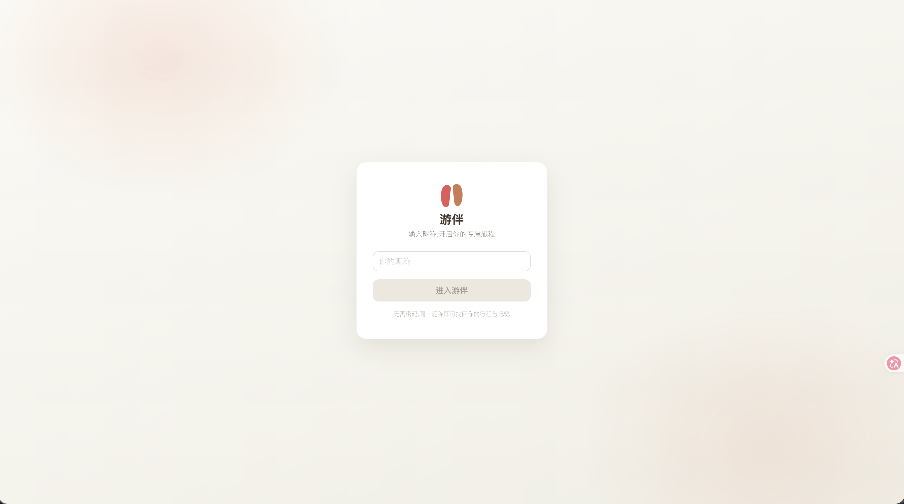
</p>

#### 2. 主界面 - 一句话描述你的旅行

<p align="center">
  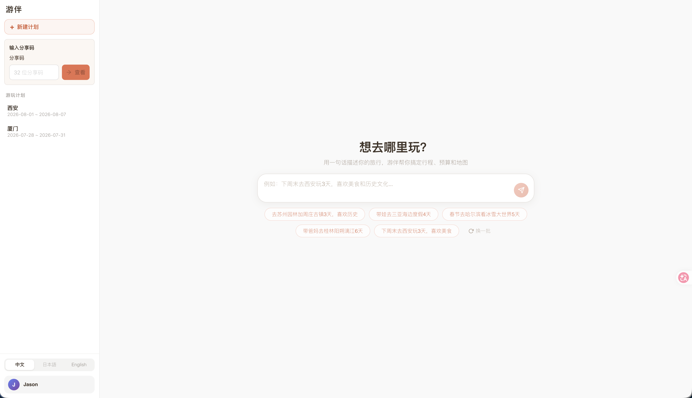
</p>

#### 3. 对话交互 - AI 理解你的需求并确认

<p align="center">
  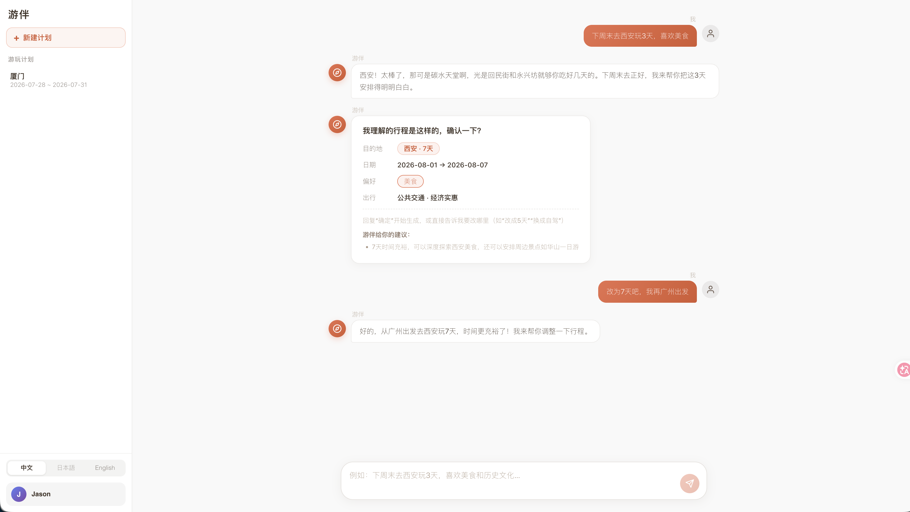
</p>

#### 4. 行程生成 - 实时展示生成进度

<p align="center">
  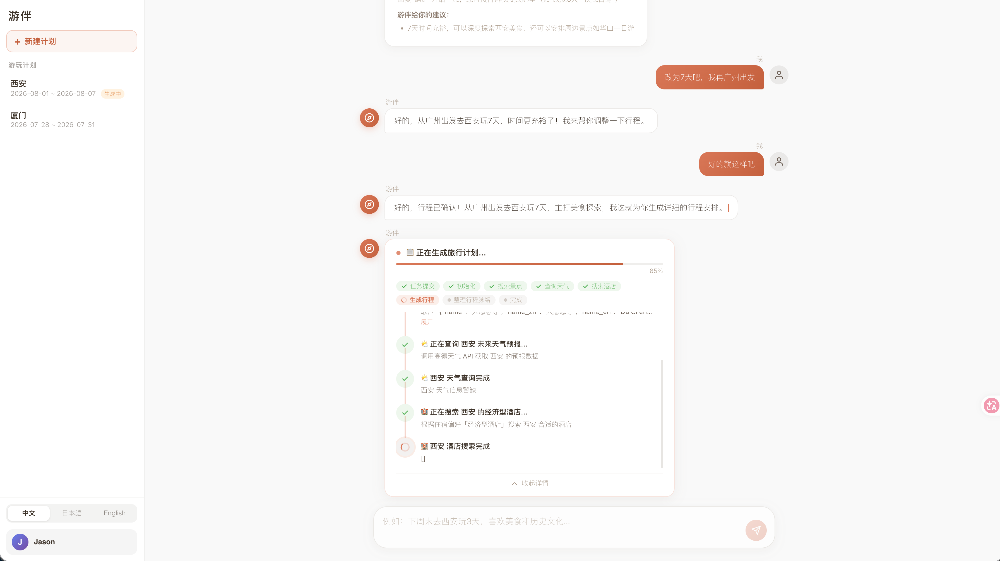
</p>

#### 5. 行程概览 - 景点卡片一目了然

<p align="center">
  
</p>

#### 6. 预算明细 - 详细费用分类统计

<p align="center">
  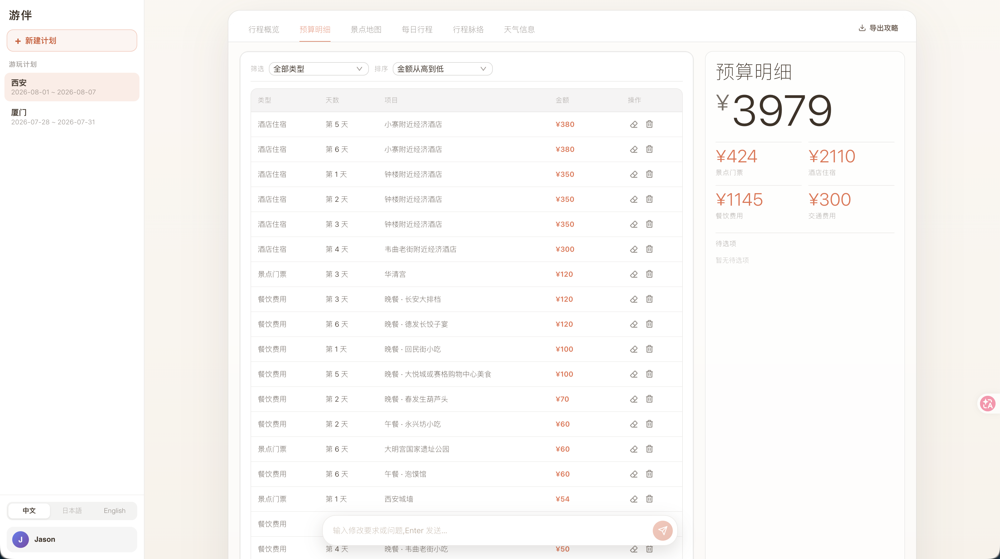
</p>

#### 7. 每日行程 - 景点、住宿、餐饮安排

<p align="center">
  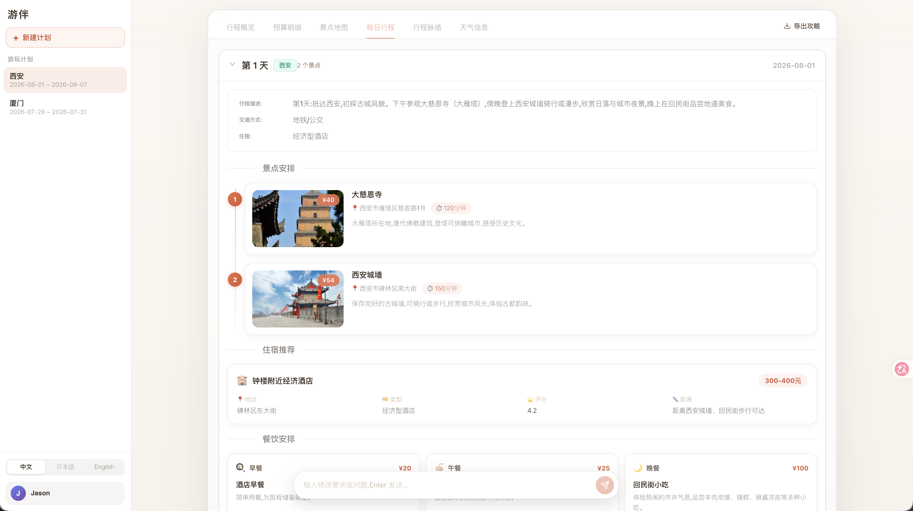
</p>

#### 8. 天气信息 - 出行天气预报

<p align="center">
  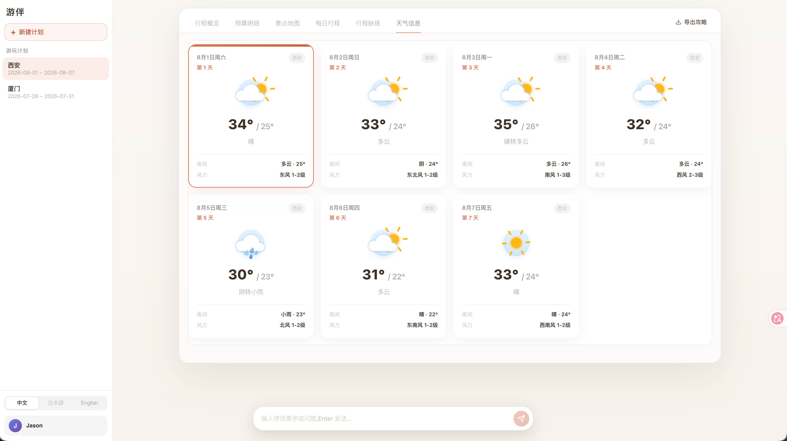
</p>

---

### 📱 移动端

<p align="center">
  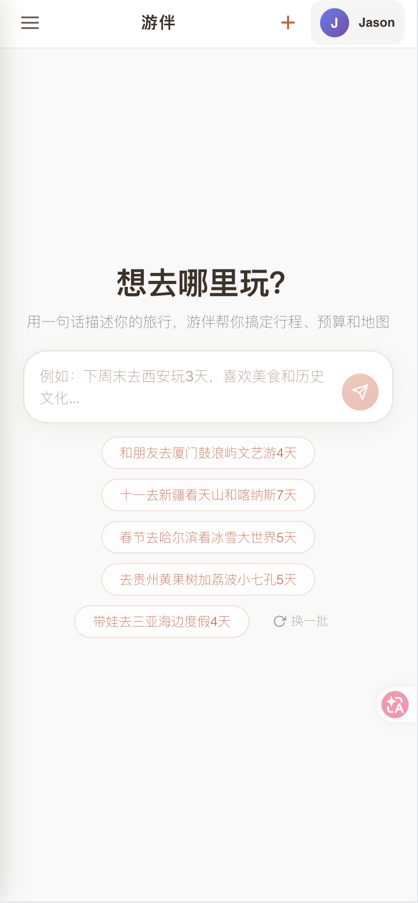
  &nbsp;&nbsp;
  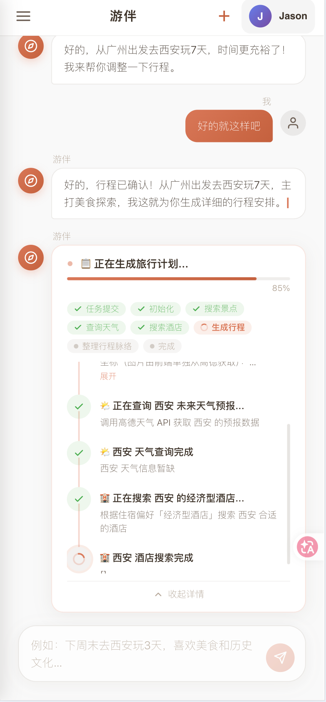
  &nbsp;&nbsp;
  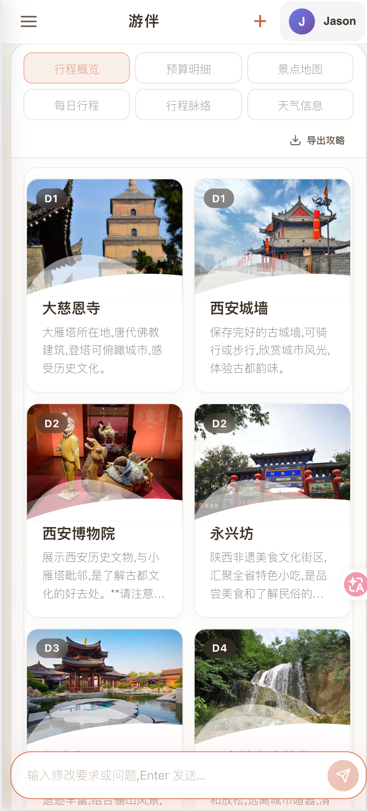
  &nbsp;&nbsp;
  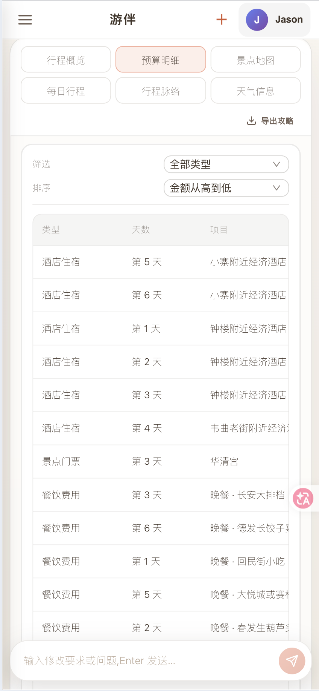
  &nbsp;&nbsp;
  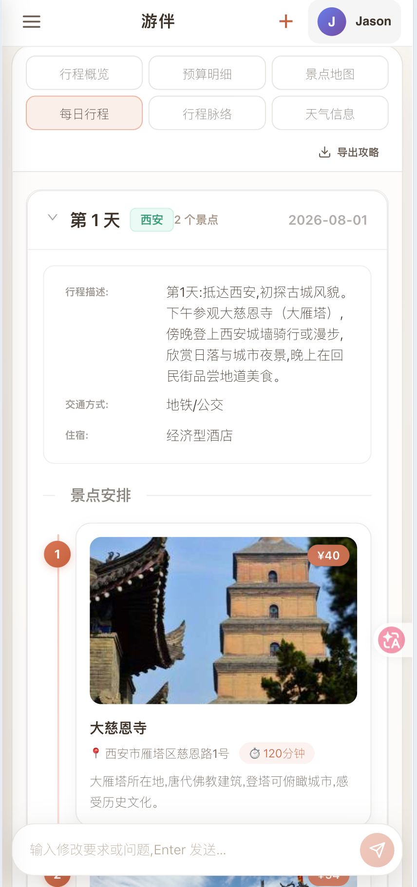
</p>

---

## ✨ 功能特性

### 🗺️ 智能行程规划
- **多日行程自动生成** - 根据目的地和天数自动规划
- **景点智能推荐** - 基于用户偏好推荐景点
- **路线优化** - 自动计算最优游览顺序
- **多城市支持** - 支持跨城市行程规划
- **旅行蓝图** - 展示阶段主题、路线逻辑、节奏与代表体验
- **自适应日程** - 按日/周/月组织长短不同行程，所有日期保持完整展开
- **参考时间线** - 统一展示城际移动、景点起止时间和用餐时间，不冒充实时班次或预约结果

### 💬 对话式交互
- **自然语言理解** - 用日常语言描述需求
- **实时流式响应** - 边生成边展示，体验流畅
- **上下文记忆** - 记住用户偏好和历史对话
- **行程调整** - 随时通过对话修改行程

### 🌤️ 天气集成
- **实时天气** - 展示目的地天气预报
- **智能建议** - 根据天气调整行程安排
- **穿衣提示** - 提供出行穿衣建议

### 📍 地图可视化
- **双地图引擎** - 高德地图（国内）+ Google Maps（海外）
- **路线展示** - 直观展示行程路线
- **POI 搜索** - 景点、餐厅、酒店搜索
- **距离计算** - 自动计算景点间距离和交通时间

### 🔖 行程管理
- **历史记录** - 保存所有行程规划
- **行程编辑** - 随时修改已规划行程
- **收藏功能** - 收藏喜欢的行程
- **导出功能** - 导出行程为图片

### 📱 分享功能
- **显式发布** - 仅计划拥有者可以为已完成行程创建分享码
- **安全分享码** - 使用 32 位高熵随机码，不直接公开内部计划编号
- **只读分享页** - 访客只能读取最终行程，不能修改预算或发起对话
- **链接与二维码** - 支持复制分享链接、分享码和下载二维码

### 🔐 后台管理
- **用户管理** - 查看和管理用户
- **行程管理** - 管理所有行程数据
- **系统配置** - 运行时配置调整
- **数据统计** - 用户和行程统计

---

## 🛠️ 技术架构

### 前端技术栈

| 技术 | 版本 | 说明 |
|------|------|------|
| [Vue 3](https://vuejs.org/) | 3.5+ | 渐进式 JavaScript 框架 |
| [TypeScript](https://www.typescriptlang.org/) | 5.7+ | 类型安全的 JavaScript 超集 |
| [Vite](https://vitejs.dev/) | 6.0+ | 下一代前端构建工具 |
| [Ant Design Vue](https://antdv.com/) | 4.2+ | 企业级 UI 组件库 |
| [Vue Router](https://router.vuejs.org/) | 4.5+ | 官方路由管理器 |
| [Pinia](https://pinia.vuejs.org/) | - | 状态管理库 |
| [Axios](https://axios-http.com/) | 1.7+ | HTTP 客户端 |
| [高德地图 JS API](https://lbs.amap.com/) | - | 国内地图服务 |
| [Google Maps](https://developers.google.com/maps) | - | 海外地图服务 |
| [vue-i18n](https://vue-i18n.intlify.dev/) | 9.14+ | 国际化插件 |
| [Playwright](https://playwright.dev/) | 1.62+ | 端到端与响应式布局测试 |

### 后端技术栈

| 技术 | 版本 | 说明 |
|------|------|------|
| [FastAPI](https://fastapi.tiangolo.com/) | 0.115+ | 高性能 Python Web 框架 |
| [LangGraph](https://langchain-ai.github.io/langgraph/) | 1.0+ | LLM Agent 编排框架 |
| [LangChain](https://langchain.com/) | - | LLM 应用开发框架 |
| [Mem0](https://mem0.ai/) | 2.0+ | AI 记忆层，持久化用户偏好 |
| [Pydantic](https://docs.pydantic.dev/) | 2.0+ | 数据验证和设置管理 |
| [Uvicorn](https://www.uvicorn.org/) | 0.32+ | ASGI 服务器 |
| [Gunicorn](https://gunicorn.org/) | 23.0+ | WSGI HTTP 服务器（生产） |
| [httpx](https://www.python-httpx.org/) | 0.27+ | 异步 HTTP 客户端 |
| [Loguru](https://github.com/Delgan/loguru) | 0.7+ | 日志库 |

### 系统架构图

```
┌─────────────────────────────────────────────────────────────┐
│                        用户浏览器                            │
└─────────────────────────┬───────────────────────────────────┘
                          │
                          ▼
┌─────────────────────────────────────────────────────────────┐
│                    前端 (Vue 3 + Vite)                       │
│  ┌─────────┐  ┌─────────┐  ┌─────────┐  ┌─────────┐       │
│  │ 对话界面 │  │ 行程展示 │  │ 地图组件 │  │ 管理后台 │       │
│  └─────────┘  └─────────┘  └─────────┘  └─────────┘       │
└─────────────────────────┬───────────────────────────────────┘
                          │ HTTP/WebSocket
                          ▼
┌─────────────────────────────────────────────────────────────┐
│                   后端 (FastAPI)                             │
│  ┌─────────────────────────────────────────────────────┐   │
│  │                    API 路由层                        │   │
│  │  /api/trip  /api/chat  /api/poi  /api/map  /admin  │   │
│  └─────────────────────────────────────────────────────┘   │
│                          │                                  │
│                          ▼                                  │
│  ┌─────────────────────────────────────────────────────┐   │
│  │                  服务层 (Services)                    │   │
│  │  LLM 服务 │ 地图服务 │ 天气服务 │ 记忆服务 │ 用户服务│   │
│  └─────────────────────────────────────────────────────┘   │
│                          │                                  │
│                          ▼                                  │
│  ┌─────────────────────────────────────────────────────┐   │
│  │              AI Agent 层 (LangGraph)                 │   │
│  │  行程规划 Agent │ 对话 Agent │ 推荐 Agent            │   │
│  └─────────────────────────────────────────────────────┘   │
└─────────────────────────┬───────────────────────────────────┘
                          │
          ┌───────────────┼───────────────┐
          ▼               ▼               ▼
    ┌──────────┐   ┌──────────┐   ┌──────────┐
    │ LLM API  │   │ 地图 API │   │ 数据存储  │
    │ (OpenAI) │   │ (高德/   │   │ (本地文件)│
    │          │   │ Google)  │   │          │
    └──────────┘   └──────────┘   └──────────┘
```

---

## 🚀 快速开始

### 环境要求

- Python 3.10+
- Node.js 18+
- npm 或 pnpm
- LLM API Key（OpenAI 或兼容 API）
- 高德地图 API Key（可选，国内地图服务）

### 1. 克隆项目

```bash
git clone https://github.com/A6083450/youban.git
cd youban
```

### 2. 配置环境变量

复制环境变量示例文件并填写配置：

```bash
cp .env.example .env
```

编辑 `.env` 文件，配置以下必要参数：

```env
# LLM API 配置（必填）
LLM_API_KEY=your_api_key_here
LLM_BASE_URL=https://api.openai.com/v1
LLM_MODEL_ID=gpt-4

# 高德地图 API（必填，用于国内地图服务）
VITE_AMAP_WEB_JS_KEY=your_amap_web_js_key
VITE_AMAP_WEB_KEY=your_amap_web_key
```

### 3. 启动后端

```bash
cd backend

# 安装 uv 包管理器（如未安装）
pip install uv

# 安装依赖
uv sync

# 启动开发服务器
uvicorn app.api.main:app --reload --host 0.0.0.0 --port 8000
```

### 4. 启动前端

```bash
cd frontend

# 安装依赖
npm install

# 启动开发服务器
npm run dev
```

访问 http://localhost:5173 即可使用。

### 5. 运行验证

```bash
# 后端模型、Agent、聊天编辑与 API 回归测试
cd backend
uv run python -m unittest \
  app.models.schemas_test \
  app.services.chat_service_test \
  app.agents.langgraph_planner_test \
  app.api.routes.trip_conversation_endpoint_test

# 前端类型检查、构建、工具测试与端到端测试
cd ../frontend
npm run build
node --test src/utils/*.test.mjs
npx playwright test
```

---

## 🐳 Docker 部署

### 使用 Docker Compose（推荐）

```bash
# 配置环境变量
export LLM_API_KEY=your_api_key
export LLM_BASE_URL=https://api.openai.com/v1
export LLM_MODEL_ID=gpt-4
export VITE_AMAP_WEB_JS_KEY=your_key
export VITE_AMAP_WEB_KEY=your_key

# 启动服务
docker-compose up -d
```

访问 http://localhost:7860 即可使用。

### 单独构建 Docker 镜像

```bash
docker build -t youban-trip-planner \
  --build-arg VITE_AMAP_WEB_JS_KEY=your_key \
  --build-arg VITE_AMAP_WEB_KEY=your_key .

docker run -p 7860:7860 \
  -e LLM_API_KEY=your_key \
  -e LLM_BASE_URL=https://api.openai.com/v1 \
  -e LLM_MODEL_ID=gpt-4 \
  youban-trip-planner
```

### 开发环境 Docker

```bash
# 使用开发环境配置（支持热重载）
docker-compose -f docker-compose.dev.yaml up
```

---

## 📁 项目结构

```
youban/
├── frontend/                    # 前端项目
│   ├── src/
│   │   ├── components/         # Vue 组件
│   │   │   ├── PlanChatPanel.vue      # 聊天面板
│   │   │   ├── TripFlow.vue           # 旅行蓝图
│   │   │   ├── DailyItinerary.vue     # 自适应每日行程
│   │   │   ├── ShareCodeEntry.vue     # 分享码输入
│   │   │   ├── WeatherDayCard.vue     # 天气卡片
│   │   │   ├── SharePlanModal.vue     # 分享弹窗
│   │   │   └── ...
│   │   ├── views/              # 页面视图
│   │   │   ├── ChatHome.vue           # 主聊天界面
│   │   │   ├── Result.vue             # 行程结果页
│   │   │   ├── ShareView.vue          # 只读分享页
│   │   │   ├── AdminView.vue          # 管理后台
│   │   │   └── LoginView.vue          # 登录页
│   │   ├── stores/             # Pinia 状态管理
│   │   ├── services/           # API 服务
│   │   ├── utils/              # 工具函数
│   │   └── i18n/               # 国际化配置
│   └── package.json
├── backend/                     # 后端项目
│   ├── app/
│   │   ├── agents/             # LangGraph Agent
│   │   │   ├── trip_planner_agent.py  # 行程规划 Agent
│   │   │   └── plan_parser.py         # 行程解析器
│   │   ├── api/                # FastAPI 路由
│   │   │   └── routes/                # API 端点
│   │   │       ├── trip.py            # 行程相关
│   │   │       ├── chat.py            # 聊天相关
│   │   │       ├── poi.py             # POI 搜索
│   │   │       ├── map.py             # 地图服务
│   │   │       └── admin.py           # 管理接口
│   │   ├── models/             # 数据模型
│   │   ├── services/           # 业务逻辑
│   │   │   ├── llm_service.py         # LLM 服务
│   │   │   ├── amap_service.py        # 高德地图
│   │   │   ├── google_map_service.py  # Google Maps
│   │   │   └── memory_service.py      # 记忆服务
│   │   └── config.py           # 配置管理
│   └── pyproject.toml
├── data/                        # 数据存储目录
│   ├── conversations/          # 对话历史
│   ├── images/                 # 图片缓存
│   ├── memory/                 # 用户记忆
│   └── users.json              # 用户数据
├── imgs/                        # 截图资源
│   ├── pc/                     # PC 端截图
│   └── phome/                  # 移动端截图
├── Dockerfile                  # 生产环境镜像
├── Dockerfile.dev              # 开发环境镜像
├── docker-compose.yaml         # 生产环境编排
├── docker-compose.dev.yaml     # 开发环境编排
├── start.sh                    # 生产启动脚本
└── start-dev.sh                # 开发启动脚本
```

---

## ⚙️ 配置说明

### LLM 配置

| 环境变量 | 说明 | 默认值 |
|---------|------|--------|
| `LLM_API_KEY` | LLM API 密钥 | - |
| `LLM_BASE_URL` | API 基础 URL | `https://api.openai.com/v1` |
| `LLM_MODEL_ID` | 模型 ID | `gpt-4` |

### 地图配置

| 环境变量 | 说明 |
|---------|------|
| `VITE_AMAP_WEB_JS_KEY` | 高德地图 Web JS API Key |
| `VITE_AMAP_WEB_KEY` | 高德地图 Web 服务 Key |
| `GOOGLE_MAPS_API_KEY` | Google Maps API Key（可选） |

### 服务配置

| 环境变量 | 说明 | 默认值 |
|---------|------|--------|
| `HOST` | 服务监听地址 | `0.0.0.0` |
| `PORT` | 服务监听端口 | `7860` |
| `LOG_LEVEL` | 日志级别 | `INFO` |
| `DATA_DIR` | 数据存储目录 | `./data` |

---

## 📖 API 文档

启动后端服务后，访问以下地址查看 API 文档：

- **Swagger UI**: http://localhost:8000/docs
- **ReDoc**: http://localhost:8000/redoc

### 主要 API 端点

| 端点 | 方法 | 说明 |
|------|------|------|
| `/api/trip/plan` | POST | 生成行程规划 |
| `/api/trip/stream` | POST | 流式生成行程 |
| `/api/trip/share/{task_id}` | POST | 计划拥有者生成或复用分享码 |
| `/api/trip/share/{share_code}` | GET | 凭分享码读取只读最终行程 |
| `/api/chat` | POST | 对话接口 |
| `/api/poi/search` | GET | POI 搜索 |
| `/api/map/route` | GET | 路线规划 |
| `/api/settings` | GET/PUT | 系统配置 |

---

## 🤝 贡献指南

欢迎提交 Issue 和 Pull Request！

1. Fork 本仓库
2. 创建特性分支 (`git checkout -b feature/AmazingFeature`)
3. 提交更改 (`git commit -m 'Add some AmazingFeature'`)
4. 推送到分支 (`git push origin feature/AmazingFeature`)
5. 创建 Pull Request

### 开发规范

- 前端代码遵循 Vue 3 Composition API 规范
- 后端代码遵循 PEP 8 规范
- 提交信息使用中文，格式：`类型: 描述`

---

## 📄 开源协议

本项目基于 [Apache License 2.0](LICENSE) 开源。

---

<p align="center">
  <strong>游伴</strong> - 让每一次旅行都成为美好回忆 ✈️
</p>

<p align="center">
  Made with ❤️ by YouBan Team
</p>
